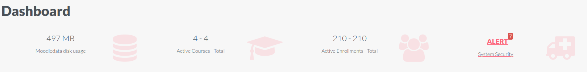

The "standartrema" Moodle Theme
============================

The theme standartrema is focused in usability and beauty.
In order to acheive this, our developers worked hard to
make it clean and easy to use for everyone.

The main goal for this theme is that the Moodle site will not need
another site for information/advertising/marketing.

Nice features in standartrema:
 - It's based in the boost theme, so it will continue to be compatible with Moodle 
 for a long time.
 - The frontpage is fully customized. It's possible to change the image 
 banner. You can create up to six beautiful cards with custom contents and
 you can add custom HTML content with no restrictions.
 - The login page is awesome with [Particles lib](https://github.com/mmacheerpuppy/particles.js).
 - We really use [Bootstrap](https://getbootstrap.com/) to make the theme fully responsive.
 - The footer is highly customizable and we have an exclusive admin area 
 block that can be seen and accessed only by the site administrator.
 - Thinking a little more about the administrators we made the admin 
 dashboard area, so that they can see in real time some data about their Moodle.
  - The colours scheme can be changed in the theme settings.
  
 

Developed and maintained by
===========================
Rodrigo Mady  
Moodle profile: https://moodle.org/user/profile.php?id=2435964  
Web profile:    https://github.com/rmady  

Trevor Furtado  
Moodle profile: https://moodle.org/user/profile.php?id=1192335  
Web profile:    https://github.com/trevorfurtado  

Support
=======
As standartrema is licensed under the GNU GPLv3 License it comes with NO support. So if you need some help
 talk to us in 'Moodle profile' in 'Developed and maintained by' above and we can discuss some improvements.
To inform errors access [Github Issues](https://github.com/standartrema-tech/moodle-theme_standartrema/issues).

Installation
============
Ensure you have the version of Moodle as stated above in 'Required version of Moodle'. This is 
necessary as the theme relies on underlying core code.
Move the folder `standartrema` to `/theme/` folder from your Moodle installation.
Access the Moodle Administration page (/admin) for do the necessary updates in your database.

Git 
Download the stable version of theme in:
`git clone https://github.com/standartrema-tech/moodle-theme_standartrema standartrema`

For uninstalling standartrema you must change the theme. And in `/theme/` remove the folder `standartrema`.

See the demo site
=======================
A demo site showing all available features of [Theme standartrema](https://standartrema.tech).

Documentation
=============
Documentation is available in [Theme standartrema](https://standartrema.tech).

Particles.js
============
The theme standartrema use the [particles.js](https://github.com/mmacheerpuppy/particles.js) a lightweight 
JavaScript library for creating particles in login.

Donate
============
Please, donate for helping us to improve Theme standartrema:
https://www.paypal.com/donate/?hosted_button_id=6FBZMX8PFPS3Y&source=qr

